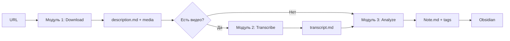

# 🧠 SecBrain - Модульная архитектура

**SecBrain** - система обработки контента из Instagram и YouTube с AI анализом для Obsidian.

## 📦 Архитектура

Система состоит из **3 независимых модулей**:

1. **Модуль 1: Загрузка контента** (`module1_download.py`)
   - Скачивает контент из Instagram и YouTube
   - Сохраняет медиа файлы и описания
   - **Без нейросетей** - только загрузка

2. **Модуль 2: Транскрибация** (`module2_transcribe.py`)
   - Сканирует папки с видео/аудио
   - Создает транскрипции с помощью Whisper
   - Сохраняет в `transcript.md` с таймингами

3. **Модуль 3: AI Анализ** (`module3_analyze.py`)
   - Анализирует контент с помощью AI
   - Создает теги и саммари
   - Сохраняет в Obsidian-совместимый `Note.md`

## 🚀 Быстрый старт

### Установка

```bash
cd /home/lexey/projects/secbrain
source venv/bin/activate
pip install -r requirements.txt
```

### Использование

#### Шаг 1: Загрузка контента

```bash
# Интерактивный режим (рекомендуется)
python module1_download.py
# Программа запросит URL для скачивания

# Или через старый интерфейс
python src/main.py
```

Результат: папка `downloads/youtube_VIDEO_ID_title/` с медиа и `description.md`

#### Шаг 2: Транскрибация (вручную)

```bash
# Обработать все папки
python module2_transcribe.py

# Или одну папку
python module2_transcribe.py --folder youtube_VIDEO_ID_title
```

Результат: файл `transcript.md` с таймингами в каждой папке с видео

#### Шаг 3: AI Анализ (вручную)

```bash
# Обработать все папки
python module3_analyze.py

# Или одну папку
python module3_analyze.py --folder youtube_VIDEO_ID_title
```

Результат: файл `Note.md` в формате Obsidian с тегами и саммари

## 📂 Структура папок

```
downloads/
├── youtube_VIDEO_ID_title/
│   ├── media_01.mp4          # Видео файл
│   ├── description.md        # Описание (Модуль 1)
│   ├── transcript.md         # Транскрипция (Модуль 2)
│   └── Note.md              # AI анализ (Модуль 3)
│
└── instagram_POST_12345_title/
    ├── media_01.jpg          # Изображение
    ├── media_02.jpg          # Второе изображение
    ├── description.md        # Описание (Модуль 1)
    └── Note.md              # AI анализ (Модуль 3)
```

## 🔧 Параметры модулей

### Модуль 2: Транскрибация

```bash
python module2_transcribe.py [OPTIONS]

Options:
  --dir PATH        Директория с контентом (по умолчанию: downloads)
  --folder NAME     Обработать только одну папку
```

**Примеры:**

```bash
# Все папки в downloads/
python module2_transcribe.py

# Все папки в custom/dir/
python module2_transcribe.py --dir custom/dir

# Одна конкретная папка
python module2_transcribe.py --folder youtube_abc123_video
```

### Модуль 3: AI Анализ

```bash
python module3_analyze.py [OPTIONS]

Options:
  --dir PATH        Директория с контентом (по умолчанию: downloads)
  --tags PATH       Файл с базой тегов (по умолчанию: tags.json)
  --folder NAME     Обработать только одну папку
```

**Примеры:**

```bash
# Все папки
python module3_analyze.py

# Все папки с кастомной базой тегов
python module3_analyze.py --tags my_tags.json

# Одна папка
python module3_analyze.py --folder instagram_POST_12345_title
```

## 📋 Примеры использования

### Полный цикл обработки YouTube видео

```bash
# 1. Загрузка
cd /home/lexey/projects/secbrain
source venv/bin/activate
python module1_download.py
# Программа запросит URL
# Вводим: https://www.youtube.com/watch?v=dQw4w9WgXcQ

# 2. Транскрибация (если есть видео/аудио)
python module2_transcribe.py

# 3. AI Анализ
python module3_analyze.py
```

### Обработка Instagram поста

```bash
# 1. Загрузка
python module1_download.py
# Вводим URL: https://www.instagram.com/p/ABC123/

# 2. AI Анализ (транскрибация не нужна для фото)
python module3_analyze.py
```

### Пакетная обработка

```bash
# Скачиваем несколько видео (вручную вводим URL)
python module1_download.py
# Вводите URL один за другим, q для выхода

# Транскрибируем все
python module2_transcribe.py

# Анализируем все
python module3_analyze.py
```

## 🎯 Особенности модулей

### Модуль 1: Загрузка

- ✅ Автоопределение источника (Instagram/YouTube)
- ✅ Автоопределение типа контента (POST/REELS/VIDEO/SHORT)
- ✅ Структурированные папки: `source_ID_title`
- ✅ Описания в Markdown формате
- ❌ Без нейросетей

### Модуль 2: Транскрибация

- ✅ Автоматическое сканирование папок
- ✅ Пропуск уже обработанных (есть `transcript.md`)
- ✅ Whisper small model (точнее base)
- ✅ Таймстемпы для каждого сегмента
- ✅ Поддержка: mp4, mp3, m4a, wav, flac, ogg
- ⚠️  Требует времени (5-10x длительность видео)

### Модуль 3: AI Анализ

- ✅ Анализ описаний и транскрипций
- ✅ Автоматическое создание тегов
- ✅ Управление базой тегов (tags.json)
- ✅ Obsidian-совместимый формат
- ✅ Frontmatter с метаданными
- ✅ Ссылки на изображения через `![[]]`
- ⚠️  Требует запущенный Ollama

## 🔄 Workflow



## 🛠️ Технологии

- **Python 3.12**: Основной язык
- **yt-dlp**: Загрузка YouTube
- **gallery-dl**: Загрузка Instagram
- **faster-whisper**: Транскрибация (local)
- **Ollama qwen2.5:7b**: AI анализ (local)
- **Playwright**: Комментарии (опционально)

## 📊 Формат Note.md (Obsidian)

```markdown
---
title: Название контента
date: 2024-12-20
tags: [#тег1, #тег2, #тег3]
source: youtube
processed: true
---

# Название контента

## 📊 Метаданные

- **Источник**: YOUTUBE
- **ID**: VIDEO_ID
- **Дата обработки**: 2024-12-20 15:30
- **Изображений**: 0
- **Транскрипция**: ✅

## 🏷️ Теги

#тег1 #тег2 #тег3

## 📝 Саммари

[AI-генерированное саммари контента...]

## 📎 Связанные файлы

- [[description.md|Описание]]
- [[transcript.md|Транскрипция]]

---

*Создано автоматически модулем AI анализа SecBrain*
```

## ⚙️ Конфигурация

### Whisper (Модуль 2)

Модель настраивается в `src/modules/local_ears.py`:

```python
model_size="small"  # base, small, medium, large
beam_size=10
temperature=0.0
```

### Ollama (Модуль 3)

Модель настраивается в `src/modules/local_brain.py`:

```python
model_name="qwen2.5:7b"
temperature=0.3
num_ctx=8192
```

### Теги (Модуль 3)

База тегов хранится в `tags.json`:

```json
{
  "строительство": {
    "count": 5,
    "aliases": ["ремонт", "стройка"]
  },
  "гипсокартон": {
    "count": 3,
    "aliases": ["гкл", "гк"]
  }
}
```

## 🐛 Troubleshooting

### Модуль 2: Whisper не работает

```bash
# Проверка модели
python -c "from faster_whisper import WhisperModel; print('OK')"

# Переустановка
pip install --upgrade faster-whisper
```

### Модуль 3: Ollama не отвечает

```bash
# Проверка Ollama
curl http://localhost:11434/api/generate -d '{"model":"qwen2.5:7b","prompt":"test"}'

# Запуск Ollama
ollama serve
```

### Транскрибация слишком долгая

```python
# В local_ears.py поменять модель
model_size="base"  # Вместо small (быстрее, но хуже)
```

## 📝 Логи и отладка

```bash
# Проверка папок
ls -la downloads/

# Проверка конкретной папки
ls -la downloads/youtube_VIDEO_ID_title/

# Чтение транскрипции
cat downloads/youtube_VIDEO_ID_title/transcript.md

# Чтение Note
cat downloads/youtube_VIDEO_ID_title/Note.md

# Проверка базы тегов
cat tags.json
```

## 🎯 Roadmap

- [ ] GUI для управления модулями
- [ ] Batch обработка из файла с URLs
- [ ] Экспорт в Notion/Anki
- [ ] Автоматический scheduled запуск
- [ ] Web интерфейс для просмотра

## 📄 Лицензия

MIT

## 👤 Автор

SecBrain - система для обработки контента с AI

---

**Документация обновлена**: 2024-12-20
